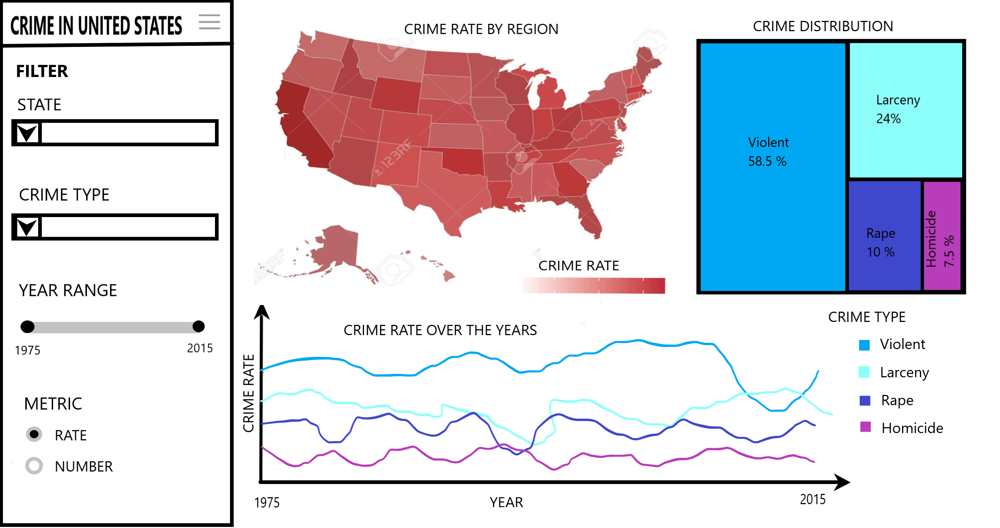

# Crime Rates in the US

Contributors | Github | 
--- | --- |
Aditya Bhatraju | @adibns |
Aishwarya Gopal | @AishwaryaGopal12  |
Charles Suresh | @charlessuresh  | 

## Dashboard Link

https://crime-dashboard-group13.herokuapp.com

  
## Description of The App

Crime statistics are important in understanding the efficacy of government initiatives introduced to tackle crime. 
They assist politicians in advocating for or against policies designed to reduce crime. They facilitate government agencies in making judgements on what is to be expected. To study these variations and try to understand some patterns, we have built a dashboard that tracks the violent crime statistics in various states of the USA from 1970-2015. Our app will show the overall trend of crime rates in the selected counties during the selected time period and also a breakdown of different crimes.

The landing page of the dashboard is designed to have four filters at the left, for selecting the states in the US, crime types (Aggravated Assault, Larceny, Rape and Homicide), year range (1975 to 2015) and the metric, rate or number (Rate is the number of crimes per 100k population. Number is the actual number of crimes). 

The US map is presented at the top of the dashboard with tooltip for each state to show the crime data related to the selected states. The level of color shading for states would be based on the value of the crime metric. To the right of the US map, there is a treemap plot. The first hierarchy of the treemap plot will show the different states selected, represented by a rectangle, with its area proportional to the number of crimes in the state. Using tooltip, the user can select a particular state, upon which the next hierarchy of the treeplot will be shown wherein the breakdown of crimes by type is shown in that paticular state. At the bottom, there will be a trend-plot showing the crime number/rate over the select years, for the selected states, grouped by different crime types

## App Sketch

